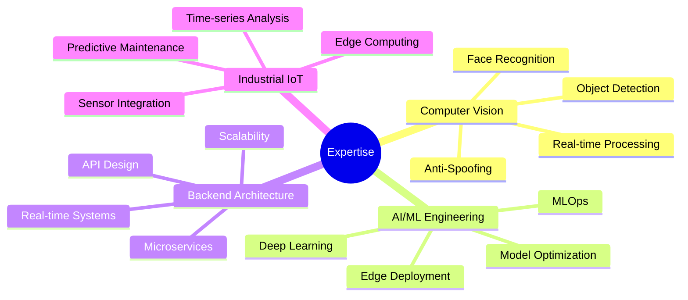

<div align="center">

<!-- Animated Header -->


<!-- Typing SVG -->
<a href="https://git.io/typing-svg"></a>

<!-- Language Badges -->
<p align="center">
  <a href="./README.md"></a>
  <a href="./README_RU.md"></a>
</p>

<!-- Profile Views Counter with Animation -->
<p align="center">
  
  
</p>

<!-- Animated Separator -->


</div>

## 🎯 **About Me**

```typescript
const ablakulov: Developer = {
  role: "Senior Full-Stack Python Engineer",
  company: "SCC",
  location: "Uzbekistan 🇺🇿",
  education: "KIUT - Information Systems Engineering",
  
  expertise: {
    ai_ml: ["Deep Learning", "Computer Vision", "Anti-Spoofing", "Anomaly Detection"],
    backend: ["Microservices", "RESTful APIs", "Real-time Systems", "Distributed Computing"],
    frontend: ["React Ecosystem", "TypeScript", "Real-time Visualization"],
    embedded: ["STM32", "IoT Integration", "Industrial Automation"]
  },
  
  currentFocus: [
    "Building enterprise-grade AI/ML solutions",
    "Real-time computer vision pipelines", 
    "Intelligent security frameworks",
    "Industrial IoT systems"
  ],
  
  motto: "Building intelligent systems that perceive, understand, and act in the real world."
};
```

<div align="center">

<!-- Animated Separator -->


## 💻 **Tech Stack Arsenal**

<!-- Tech Stack with animated hover effects -->

### 🔥 **Core Languages**

<p align="center">
  
  
  
  
  
</p>

### 🎨 **Frontend Development**

<p align="center">
  
  
  
  
  
  
</p>

### ⚙️ **Backend Engineering**

<p align="center">
  
  
  
  
  
</p>

### 🤖 **AI/ML & Computer Vision**

<p align="center">
  
  
  
  
  
  
  
</p>

### 🗄️ **Databases & Caching**

<p align="center">
  
  
  
  
  
</p>

### 🔧 **DevOps & Cloud**

<p align="center">
  
  
  
  
  
</p>

### 🔌 **Embedded & IoT**

<p align="center">
  
  
  
  
</p>

### 🛠️ **Tools & Platforms**

<p align="center">
  
  
  
  
  
</p>

<!-- Animated Separator -->


</div>

## 🚀 **Featured Projects Portfolio**

<details open>
<summary><b>🏪 Digital Market Intelligence Platform</b></summary>

<br/>

> Enterprise retail analytics system with advanced computer vision capabilities

**🎯 Key Features:**
- 🔍 Automated shelf monitoring with YOLO-based object detection
- 📊 Real-time product availability tracking and alerts
- 🔥 ROI-based activity heatmap analysis
- 🔌 RESTful API for seamless third-party integrations
- 📈 Predictive inventory management

**💡 Technology Stack:**
```yaml
Backend:    Python, FastAPI, Celery
AI/ML:      PyTorch, YOLO, OpenCV
Frontend:   React, TypeScript, Redux
Database:   PostgreSQL, Redis
Deployment: Docker, Kubernetes, Nginx
```

**📊 Business Impact:**
- ✅ 40% reduction in manual inventory checking time
- ✅ Real-time insights across 15+ retail locations
- ✅ 99.3% detection accuracy in production
- ✅ Processing 10K+ frames per hour per location

</details>

<details>
<summary><b>🎥 PTZ-Control: Intelligent Camera Management System</b></summary>

<br/>

> Advanced PTZ camera control with automatic ROI detection and multi-vendor support

**🎯 Core Capabilities:**
- 🎯 Dynamic region of interest calculation using computer vision
- 📡 ONVIF protocol integration for universal camera support
- 🎬 Real-time video stream processing with WebRTC
- 🔄 WebSocket-based live updates for instant feedback
- 🎮 Intuitive control interface with preset management

**💡 Architecture:**
```yaml
Backend:      Python, FastAPI, ONVIF
Frontend:     TypeScript, React, WebRTC
Processing:   OpenCV, NumPy, async processing
Streaming:    WebSocket, RTSP, HTTP
Deployment:   Microservices, Docker Compose
```

**🔧 Technical Highlights:**
- Sub-second response time for PTZ commands
- Support for 50+ concurrent camera streams
- Automatic failover and reconnection logic
- RESTful API for automation and integration

</details>

<details>
<summary><b>🛡️ Face Anti-Spoofing Authentication System</b></summary>

<br/>

> Military-grade AI-powered face anti-spoofing for secure authentication

**🎯 Security Features:**
- 🔬 Multi-modal liveness detection (texture, depth, motion analysis)
- 🧠 Ensemble of CNNs and Vision Transformers
- ⚡ <0.5% False Acceptance Rate in production environment
- 🚀 Edge deployment with ONNX optimization
- 🔒 Privacy-first architecture with local processing

**💡 Technical Stack:**
```yaml
AI/ML:        PyTorch, ONNX Runtime, MediaPipe
Models:       ResNet, EfficientNet, Vision Transformer
Backend:      FastAPI, WebSocket
Deployment:   Docker, ONNX, TensorRT
Security:     End-to-end encryption, secure storage
```

**🎓 Research Contributions:**
- Novel texture-based spoofing detection: 99.2% accuracy
- Real-time processing: <100ms per frame on CPU
- Robust against print, replay, and 3D mask attacks

</details>

<details>
<summary><b>📚 Proctoring Suite: Academic Integrity Platform</b></summary>

<br/>

> Comprehensive AI-powered exam monitoring with privacy-first approach

**🎯 Monitoring Capabilities:**
- 👁️ Multi-point gaze tracking with head pose estimation
- 📱 Prohibited object detection (phones, papers, secondary screens)
- 🎭 Behavioral anomaly scoring and pattern recognition
- 🔒 Privacy-first architecture with local processing
- 📊 Real-time dashboard for proctors
- 📹 Automated incident flagging and timestamping

**💡 Technology:**
```yaml
AI/ML:      MediaPipe, YOLOv8, OpenCV
Backend:    Python, FastAPI, WebSocket
Frontend:   React, TypeScript, Chart.js
Real-time:  WebRTC, Socket.io
Storage:    PostgreSQL, S3-compatible
```

**✨ Features:**
- Multi-camera support (webcam + screen recording)
- Adaptive detection thresholds
- Offline mode with sync capability
- GDPR-compliant data handling

</details>

<details>
<summary><b>🏭 Predictive Maintenance for NGMK Mining Equipment</b></summary>

<br/>

> Industrial IoT solution preventing equipment failures before they happen

**🎯 Predictive Analytics:**
- 📈 Time-series analysis with LSTM neural networks
- 🔗 Multi-sensor data fusion (vibration, temperature, pressure)
- 🚨 Anomaly detection using Isolation Forest and Autoencoders
- ⏰ 72-hour failure prediction window
- 📊 Interactive dashboards with Grafana

**💡 Technology:**
```yaml
AI/ML:        TensorFlow, scikit-learn, Prophet
Backend:      Python, FastAPI, Celery
Database:     TimescaleDB, InfluxDB
Monitoring:   Grafana, Prometheus
Edge:         Edge computing, MQTT
```

**💰 Business Impact:**
- ✅ 30% reduction in unplanned downtime
- ✅ $200K+ annual savings
- ✅ 85% prediction accuracy
- ✅ Monitoring 50+ critical equipment units

</details>

<details>
<summary><b>⛓️ STM32-Based Secure Transaction System</b></summary>

<br/>

> Embedded blockchain implementation for ATM security

**🎯 Security Features:**
- 🔐 Custom lightweight blockchain protocol
- ✍️ ECDSA signature verification
- 🔒 Hardware secure element integration
- ⚡ Transaction validation <100ms
- 🛡️ Tamper-proof transaction logging

**💡 Technology:**
```yaml
Embedded:     C, STM32 HAL, ARM Cortex-M
RTOS:         FreeRTOS
Crypto:       mbedTLS, Hardware accelerators
Protocol:     Custom blockchain, UART, SPI
```

**🔧 Technical Achievements:**
- Real-time cryptographic operations
- Power-efficient implementation
- Secure boot and firmware updates
- Resilient to power failures

</details>

<div align="center">

<!-- Animated Separator -->


## 📊 **GitHub Statistics**

<!-- GitHub Stats Cards -->
<p align="center">
  
  
</p>

<!-- Activity Graph -->
<p align="center">
  
</p>

<!-- Most Used Languages -->
<p align="center">
  
</p>

<!-- Trophies -->
<p align="center">
  
</p>

<!-- Animated Separator -->


</div>

## 🎯 **Professional Focus & Expertise**

<table>
<tr>
<td width="50%">

### 🔥 Current Focus



</td>
<td width="50%">

### 🎓 Learning & Growth

- 🚀 Advanced MLOps and model versioning
- ☁️ Cloud-native architectures (AWS, GCP)
- 🔒 Zero-trust security frameworks
- 🤖 Transformer architectures for CV
- 📊 Large-scale data engineering
- 🌐 Distributed systems design
- ⚡ Real-time streaming architectures

### 🎯 2024 Goals

- [ ] Contribute to open-source AI projects
- [ ] Publish research papers on anti-spoofing
- [ ] Build production-ready MLOps platform
- [ ] Master Kubernetes orchestration
- [ ] Develop edge AI frameworks

</td>
</tr>
</table>

<div align="center">

<!-- Animated Separator -->


## 🏆 **Achievements & Recognition**

</div>

<p align="center">
  
  
  
  
</p>

```text
📊 Code Quality Metrics:
├─ Production Systems Deployed      : 15+
├─ Lines of Code Written            : 500K+
├─ API Endpoints Architected        : 200+
├─ ML Models in Production          : 12
├─ Open Source Contributions        : 50+
└─ Technical Mentoring Hours        : 300+
```

<div align="center">

<!-- Animated Separator -->


## 🤝 **Let's Connect & Collaborate**

<p align="center">
  <a href="https://t.me/FROWNINGnrx">
    
  </a>
  <a href="https://linkedin.com/in/your-profile">
    
  </a>
  <a href="mailto:your.email@example.com">
    
  </a>
  <a href="https://github.com/FROWNINGdev">
    
  </a>
</p>

### 💬 Open for:

<p align="center">
  
  
  
  
</p>

<!-- Animated Separator -->


## 💭 **Inspiration**

> *"The best way to predict the future is to invent it."* — Alan Kay

> *"Building intelligent systems that perceive, understand, and act in the real world."*

<!-- Contribution Snake Animation -->
<picture>
  <source media="(prefers-color-scheme: dark)" srcset="https://raw.githubusercontent.com/FROWNINGdev/FROWNINGdev/output/github-contribution-grid-snake-dark.svg">
  <source media="(prefers-color-scheme: light)" srcset="https://raw.githubusercontent.com/FROWNINGdev/FROWNINGdev/output/github-contribution-grid-snake.svg">
  
</picture>

<!-- Footer Wave -->


</div>

---

<div align="center">

**⚡ Fun Fact:** When I'm not building AI systems, I'm probably debugging why my coffee machine isn't working (spoiler: it's always user error) ☕

**🎯 Current Status:** Building the future, one commit at a time 🚀


**Made with 💙 and lots of ☕**

</div>
